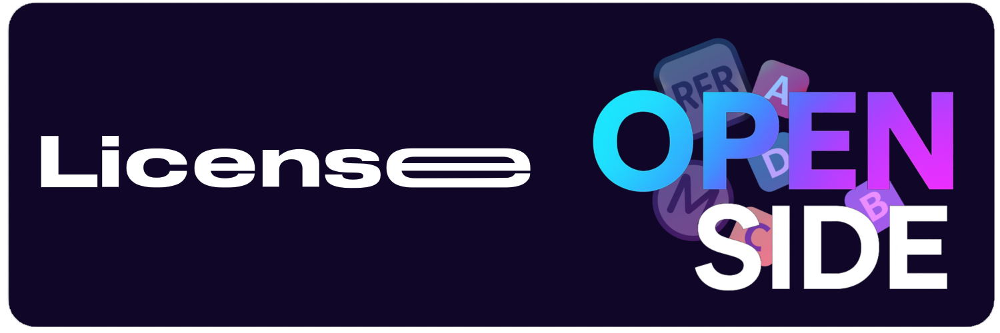

# 📜 Licence OpenSide – Explications détaillées

**Copyright © 2025 Naël MOGHIR**  
**Tous droits réservés.**

---

## 1️⃣ Usage autorisé

- Tu peux **consulter le code** pour voir comment le projet fonctionne.  
- Tu peux **tester le site localement** pour ton usage personnel.  

---

## 2️⃣ Usage interdit

**Sans autorisation écrite de l’auteur, il est strictement interdit de :**  

- Copier le code ou les fichiers du projet  
- Modifier le projet pour le redistribuer  
- Publier ou vendre le projet sous ton nom ou à titre commercial  
- Créer des projets dérivés qui utilisent OpenSide  

---

## 3️⃣ Pourquoi cette licence

- OpenSide est un projet **personnel / privé**.  
- L’objectif est de **protéger le code** et de **préserver l’identité du projet**.  
- Cela garantit que le travail de développement reste sous ton contrôle exclusif.  

---

## 4️⃣ Contact pour autorisation

Si quelqu’un souhaite utiliser, modifier ou redistribuer OpenSide, il doit contacter directement l’auteur :  

**Naël MOGHIR**  
📧   

Une autorisation écrite devra être fournie pour tout usage extérieur au projet.  

---

> ⚠️ Tout manquement à cette licence constitue une violation des droits d’auteur et peut entraîner des actions légales.
